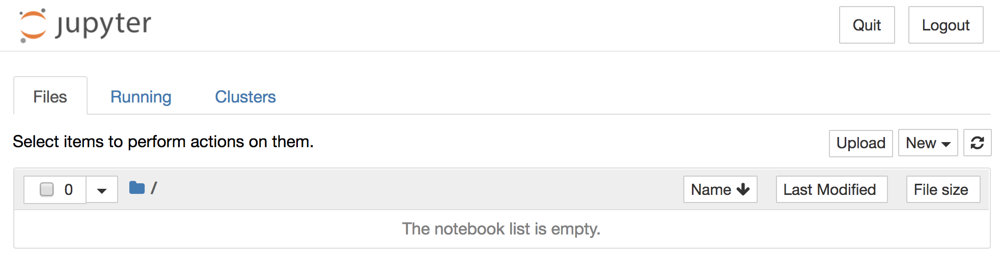

# Challenge: Install Jupyter Notebook


## Introduction

[Project Jupyter](http://jupyter.org/about) is a non-profit, open-source project dedicated to supporting interactive data science and scientific computing. It has been widely used by data scientists and analysts in working with data. In this course we will use Jupyter Notebook as the main workspace for the hands-on work because it is very convenient to compile and test your Python code in Jupyter Notebook.

## Install Jupyter Notebook

There are three ways to install Jupyter Notebook. Again, for this course we recommend you to install with Homebrew:

```
$ brew install jupyter
```

The second way is to install Jupyter Notebook with the [Anaconda Distribution](https://www.anaconda.com/download/). Anaconda will install Python, Jupyter Notebook, and other commonly used packages useful in scientific computing and data science. Since we already have Python installed and will only use selected packages in this course, you don't have to install Jupyter Notebook with Anaconda.

The third way is to use pip to install Jupyter Notebook. [Pip](https://pypi.org/project/pip/) is a package management tool for Python, just like Homebrew which is a package management tool for Mac. Pip is installed by default with Python so you don't have to install it separately. But you'll want to upgrade pip before using it to install Jupyter Notebook:

```
$ python3 -m pip install --upgrade pip
$ python3 -m pip install jupyter
```

### Is it working?

After installing Jupyter Notebook, run the following command in the terminal to launch it. Jupyter Notebook will be served from the directory where you run the command.

```
$ jupyter notebook
[I 22:49:03.262 NotebookApp] Serving notebooks from local directory: /Users/CurrentUser/Desktop
[I 22:49:03.262 NotebookApp] 0 active kernels
[I 22:49:03.262 NotebookApp] The Jupyter Notebook is running at:
[I 22:49:03.262 NotebookApp] http://localhost:8888/?token=8fcea448502a9a9f26533e446744bd71e64890f9f35e219c
[I 22:49:03.262 NotebookApp] Use Control-C to stop this server and shut down all kernels (twice to skip confirmation).
[C 22:49:03.267 NotebookApp]

    Copy/paste this URL into your browser when you connect for the first time,
    to login with a token:
        http://localhost:8888/?token=8fcea448502a9a9f26533e446744bd71e64890f9f35e219c&token=8fcea448502a9a9f26533e446744bd71e64890f9f35e219c
[I 22:49:03.440 NotebookApp] Accepting one-time-token-authenticated connection from ::1
```

A new browser tab should be automatically opened which looks like the following (depending on where you launched Jupyter Notebook):



If you encounter any problem in installing or using Jupyter Notebook, refer to the official [installation instructions](http://jupyter.org/install) and [documentation](http://jupyter.org/documentation).

## Summary

TBD
