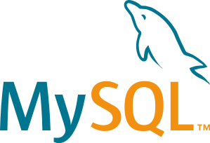
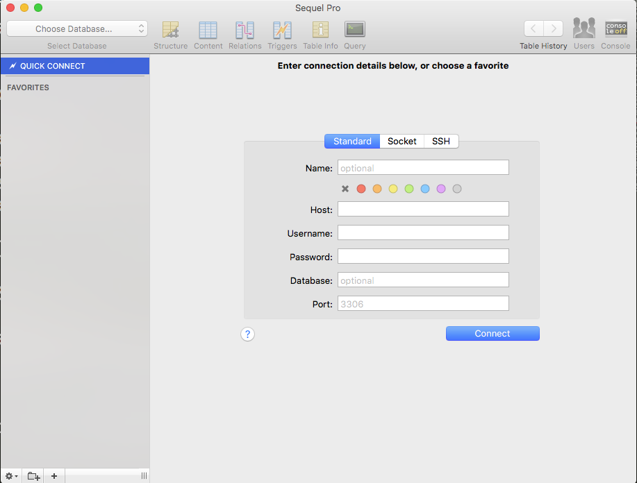
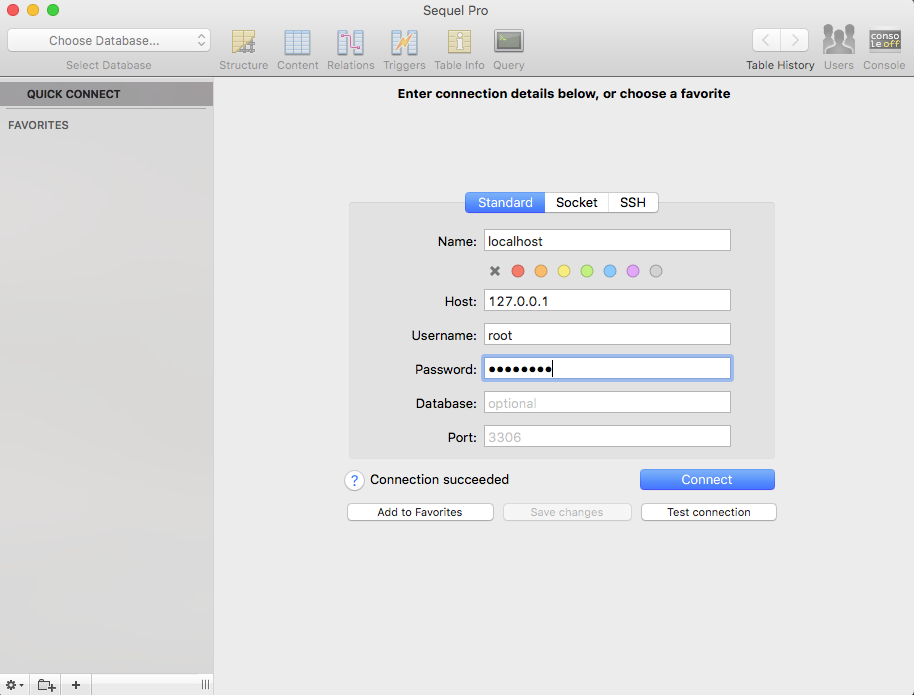
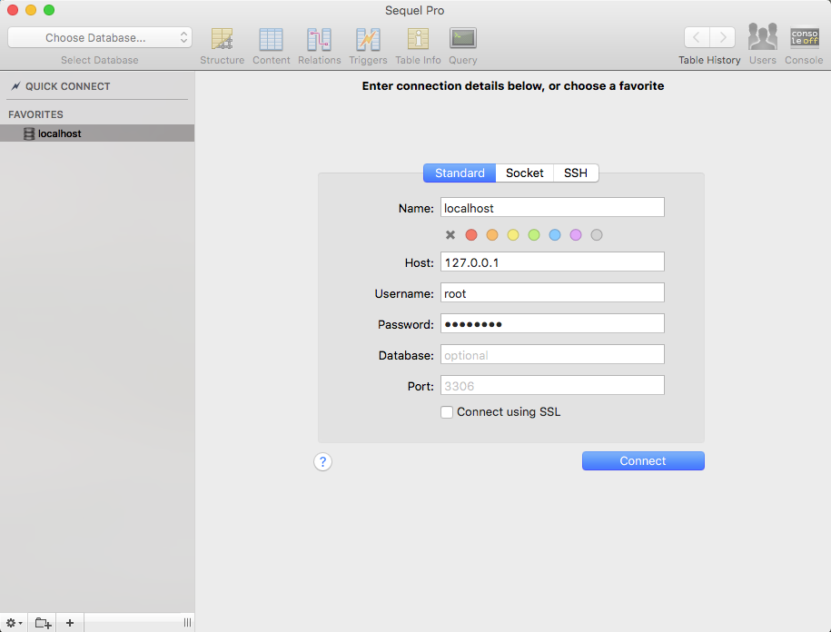
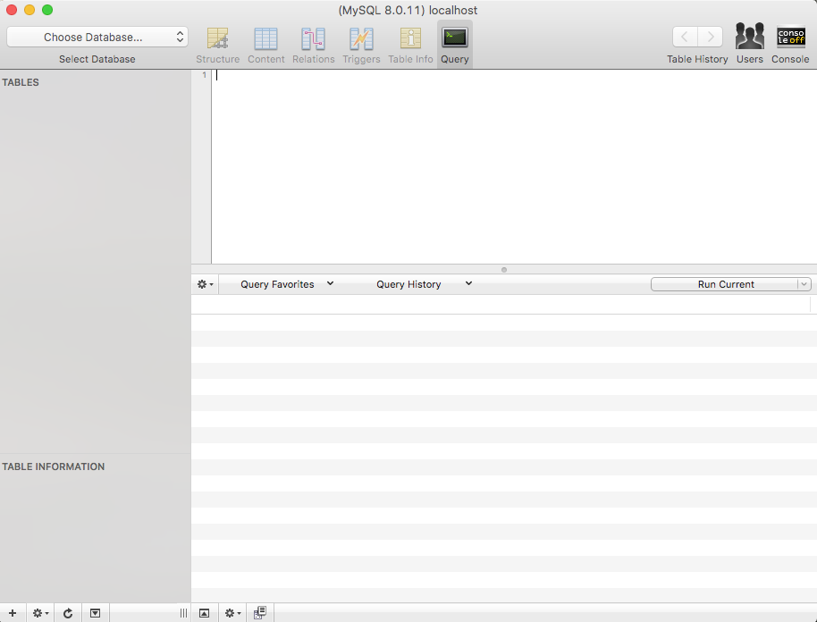

# Challenge: Install MySQL and Sequel Pro

## Introduction

Structured Query Language (SQL) is the most prevalent database technology in the world allowing one to perform database operations such as storing, retrieving, updating, and deleting data. In this course you will learn [MySQL](https://www.mysql.com/), a popular genre of SQL which is free. After mastering MySQL, you should have no problem in picking up other SQL genres such as MS SQL (by Microsoft), PostgreSQL, and SQLite because these languages are similar in a large part.

:bulb: SQL is also known as the Relational Databases because they are based on the relational algebra theory. The opposite of SQL is NoSQL also known as the Non-Relational Databases. The main difference between SQL and NoSQL is how they store data - the latter does not require a specific structure of the data in order to store them. An example of the NoSQL database is [MongoDB](https://www.mongodb.com/).

In this challenge, you will install MySQL and a data management application for Mac called Sequel Pro.

## MySQL



### Install MySQL

To install MySQL with Homebrew, run the following command in the terminal:

```
$ brew install mysql
```

Homebrew will install the MySQL Community Edition for you. Alternatively, you can also [download the MySQL Community Server](https://dev.mysql.com/downloads/mysql/) and follow the [official installation documentation](https://dev.mysql.com/doc/refman/8.0/en/installing.html) to install. Make sure to download the latest version v8.x.x.

:warning: For Mac users, it is recommended to use Homebrew to install MySQL. The official MySQL installation package is known to have issues in working properly for some users. If you installed with the official installation package and find issues, uninstall it then re-install with Homebrew.

### Is it working?

Type `mysql -u root -p` in the terminal to test your MySQL installation, where `-u root` means your MySQL username is `root` and `-p` means a password is required.

While being prompted to enter password, simply hit the ENTER key because your password is empty at this point.

```
$ mysql -u root -p
Enter password:
Welcome to the MySQL monitor.  Commands end with ; or \g.
Your MySQL connection id is 11
Server version: 8.0.11 Homebrew

Copyright (c) 2000, 2018, Oracle and/or its affiliates. All rights reserved.

Oracle is a registered trademark of Oracle Corporation and/or its
affiliates. Other names may be trademarks of their respective
owners.

Type 'help;' or '\h' for help. Type '\c' to clear the current input statement.

mysql>
```

If you see the welcome message and the `mysql>` prompt, congratulations for successfully installing MySQL!

You should configure MySQL immediately after installation. Follow the steps below to change the default root password.

### Changing default password

Homebrew installs MySQL with the username `root` and an empty password. It is a good practice to add a password to the `root` user in order to protect your database. In MySQL command line, type the following command (**remember to change `new_password` to your desired password**):

```
mysql> ALTER USER 'root'@'localhost' IDENTIFIED BY 'new_password';
Query OK, 0 rows affected (0.07 sec)
```

After changing the password, exit MySQL command line and re-enter:

```
mysql> exit;
Bye

$ mysql -u root -p
Enter password:
mysql>
```

Note that every MySQL command should end with a semicolon (`;`). While being prompted to enter the password, enter your new password then hit ENTER.

:bulb: You can choose to continue using the default empty MySQL password if you are sure your database will be safe without a password. In that case, skip the step of changing the password. But in production, every database must be protected by a complex password.

:bangbang: **Alert: Please save your MySQL username and password in a safe place where you know where to find.**

### Starting `mysql` service

After installing MySQL with Homebrew, the `mysql` service should automatically start every time your computer starts. However, if MySQL is not running for any reason and you try to access MySQL command line, you will see the following error:

```
$ mysql -u root -p
Enter password:
ERROR 2002 (HY000): Can't connect to local MySQL server through socket '/tmp/mysql.sock' (2)
```

If this happens, start the `mysql` service manually with the following command:

```
$ brew services start mysql
==> Successfully started `mysql` (label: homebrew.mxcl.mysql)
```

:bulb: If your MySQL was installed using the MySQL installation package instead of Homebrew, the best way to manage it is using the MySQL Launch Daemon which you can find in your System Preferences:


In the daemon, select the MySQL instance you installed and click Start MySQL Server.


Read the [official documentation](https://dev.mysql.com/doc/refman/8.0/en/osx-installation-launchd.html) on MySQL Launch Daemon for more information.

## Sequel Pro

It is inconvenient to use MySQL command line to interact with the database. Therefore, we will install [Sequel Pro](https://www.sequelpro.com/) - a database management software allowing you to complete database operations conveniently.


### Install Sequel Pro

Sequel Pro can be installed with either Brew Cask or the official installation package. To install with Brew Cask, run:

```
$ brew cask install sequel-pro
```

To install using the official installation package, check out the [Sequel Pro official download page](https://sequelpro.com/download).

### Connecting Sequel Pro to Database

1. Locate Sequel Pro in your Applications and launch the software. You will see the following connection window:

    

1. Enter the Name, Host, Username, and Password as shown in the following screenshot. Use the password you set for your MySQL in previous steps. Click "Test connection". You should see a message that says `Connection succeeded`.

    

1. Click "Add to Favorites" so that you can reuse this MySQL connection in the future.

    

1. Now click "Connect" to connect to your MySQL database:

    

Nice work! Now you have installed Sequel Pro and can use it to interact with your MySQL database!

## Summary

TBD
