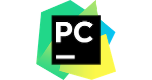

# Challenge: Install Python and PyCharm

## Introduction

This course will be taught using the Python Programming Language. Therefore, in this challenge we will install Python as well as PyCharm, an Integrated Development Environment (IDE) for Python.

## Python


Python is a general-purpose programming language that is gaining popularity in data analytics and data science.

### Install Python

Python has come pre-installed on Mac for many years. However, we are going to install Python ourselves for a few reasons:

* Currently MacOS High Sierra or older versions have Python 2.7 pre-installed. However, this course will use Python 3 because Python 2.7 will be deprecated in the near future and some packages already only support Python 3.
* Using the pre-installed Python version means that updating your MacOS will wipe out your Python packages, forcing you to re-install them.
* The pre-installed version might not be the most up-to-date.

#### Install Using Homebrew

To install the latest version of Python 3, enter in the terminal:

```
$ brew install python3
```

#### Is it Working?

To check if the installation was successful, type the following in the terminal:

```
$ python3 --version
Python 3.7.0
```

If you see that, then you have correctly installed Python!


## PyCharm



PyCharm is an Integrated Development Environment (IDE) made primarily for Python. An IDE is essentially like a word processor for code. PyCharm allows us to write code more effectively with features like auto-completion and debugging. We can also easily integrate PyCharm with Git.

### Install PyCharm

1. To install PhCharm using Brew Cask (recommended), simply run the following command in the terminal:

```
$ brew cask install pycharm
```

2. You can also download the PyCharm installer from the [following webpage](https://www.jetbrains.com/pycharm/download/#section=mac) and follow the directions. Make sure to download the community edition rather than the professional edition.

:bulb: Tip: Many of the current software vendors offer the Community Edition of their software for free. Often times, the Community Edition is open-source, has a restrictive license, or has a limited feature set in comparison with the paid editions such as the Professional Edition, Enterprise Edition, etc.

## Summary

In this challenge we installed Python, a programming language commonly used for data analysis.

We also installed PyCharm, an IDE used for developing with Python.

Using these tools, we can finally start writing code to perform data analysis!
