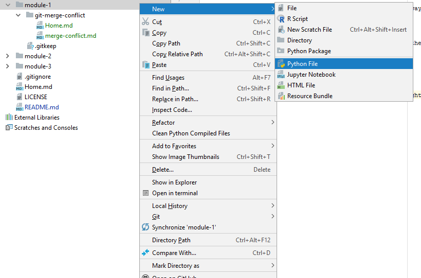
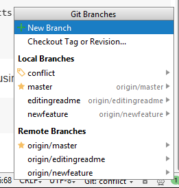
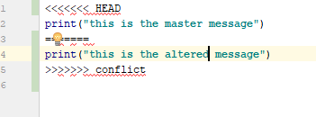
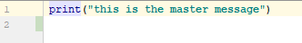

# Guided Lesson - Resolving Merge Conflicts in Git

## Introduction
When working collaboratively, sometimes we tend to step on each other's toes. What this means is that sometimes we and other developers happen to edit the same code at the same time. While we might try to keep our changes isolated with branching, this does not prevent editing the same lines of code by two different people.

It is crucial that we learn how to resolve these conflicts as simply as possible. This is because the thing that scares away developers from Git the most is merge conflicts. We would like you to have strong Git Fu so we think you should tackle this problem head on. Let's start by setting up a merge conflict and then resolving it.

## Creating a Merge Conflict

In order to create a merge conflict, we will create a Python file in PyCharm, create a new branch and change the code in the file. We will then change the code in the main branch and then proceed to merge the new branch with the main branch.

### Adding a file to the repo

We open PyCharm and open the `data-labs` folder.

In our `data-labs` repo, we will add a python file to this current module (module 1) and name the file `git-fu.py`. We right click the `module-1` folder and select Python file.

 

When PyCharm prompts you to add the file to Git, make sure to choose yes. You can also add it manually by typing this in the terminal:

```
git add .
```

We will add one line of code to the file for the sake of simplicity. The file contains only this line of code:

```
print("this is the original message")
```

Now we commit and push the repository using the following commands:

```
$ git commit -am "adding git-fu file"
[conflict fdbdb3c] adding git-fu file
 1 file changed, 24 insertions(+), 1 deletion(-)
$ git push
Enumerating objects: 18, done.
Counting objects: 100% (17/17), done.
Delta compression using up to 8 threads.
Compressing objects: 100% (10/10), done.
Writing objects: 100% (12/12), 31.53 KiB | 10.51 MiB/s, done.
Total 12 (delta 3), reused 0 (delta 0)
remote: Resolving deltas: 100% (3/3), completed with 2 local objects.
To https://github.com/ironhack/data-labs.git
   7f7f613..8b37c4f  master -> master
```

Now we will create a new branch and switch to this branch. We do this using the following command:

```
$ git checkout -b conflict
```

We can also create a new branch in the git menu on the bottom right in PyCharm.



In the conflict branch we now alter the line of code in the `git-fu.py` file to this:

```
print("this is the altered message")
```

We now commit and push this change:

```
$ git commit -am "altering git-fu file"
[conflict 775ed66] altering git-fu file
 2 files changed, 35 insertions(+), 3 deletions(-)
$ git push --set-upstream origin conflict
Enumerating objects: 11, done.
Counting objects: 100% (11/11), done.
Delta compression using up to 8 threads.
Compressing objects: 100% (5/5), done.
Writing objects: 100% (6/6), 1.08 KiB | 1.08 MiB/s, done.
Total 6 (delta 2), reused 0 (delta 0)
remote: Resolving deltas: 100% (2/2), completed with 2 local objects.
To https://github.com/ironhack/data-labs.git
 * [new branch]      conflict -> conflict
Branch 'conflict' set up to track remote branch 'conflict' from 'origin'.
```

### Merging the Branches

Now that we have set up the conflict, let's resolve it.

We start by navigating to the master branch and merge the conflict branch into the master branch.

```
$ git checkout master
$ git 
```

Now we go back to the master branch and change the text again and commit and push it.

The idea behind doing this is that the original text was determined in the master branch initially. In order to create a conflict, we must make sure both branches diverged from the original text.

We alter the text to:

```
print("this is the master message")
```

Now we head back to the terminal and type:

```
$ git merge conflict
Auto-merging module-1/git-fu.py
CONFLICT (content): Merge conflict in module-1/git-fu.py
Automatic merge failed; fix conflicts and then commit the result.
```

Oh no! Our merge failed. PyCharm wants us to fix this. We can head back to PyCharm and find that our `git-fu.py` file now looks like this:



You will also notice that our master branch is now called Merging master. 

In order to fix the conflict, we need to select the code we want to keep and erase the conflict boundaries.

In this case, we want to keep the code in the master branch and so what we are left with is this:



We now commit the merged change. We should commit using an informative message and then push our code again.

```
$ git commit -am "resolving merge conflict"
[master f360c5e] resolving merge conflict
$ git push
Enumerating objects: 14, done.
Counting objects: 100% (14/14), done.
Delta compression using up to 8 threads.
Compressing objects: 100% (6/6), done.
Writing objects: 100% (8/8), 721 bytes | 721.00 KiB/s, done.
Total 8 (delta 4), reused 0 (delta 0)
remote: Resolving deltas: 100% (4/4), completed with 3 local objects.
To https://github.com/ironhack/data-labs.git
   8b37c4f..f360c5e  master -> master
```

Now the conflict is resolved and the branches are merged.

### Aborting the Merge

Perhaps you didn't realize there was a conflict. Now there are hundreds of lines of code that you have to resolve. Maybe it would be better to use a different strategy. If you'd like to abort the merge, first we can check the status:

```
$ git status
On branch master
Your branch is up to date with 'origin/master'.

You have unmerged paths.
  (fix conflicts and run "git commit")
  (use "git merge --abort" to abort the merge)
```

The `git status` command gives you the correct command to abort the merge. Now we will type it to go back to the pre-merged state

```
$ git merge --abort
```

As you can see, the branch name changed back from master|MERGING to master, so everything is back to normal.

### Resolving the Conflict Using Ours and Theirs

Instead of resolving the conflict line by line, we can making a sweeping decision to accept a file from our branch as is (so from the master branch) or from their branch as is.
To do this, we use the commands `ours` and `theirs`.

In this example, before merging, we would navigate to the master branch. If we wanted to keep the master branch's version of `git-fu.py` we would type the following command before merging:

```
$ git checkout --ours -- ./module-1/git-fu.py
```

### Conflicts with Pull Requests 