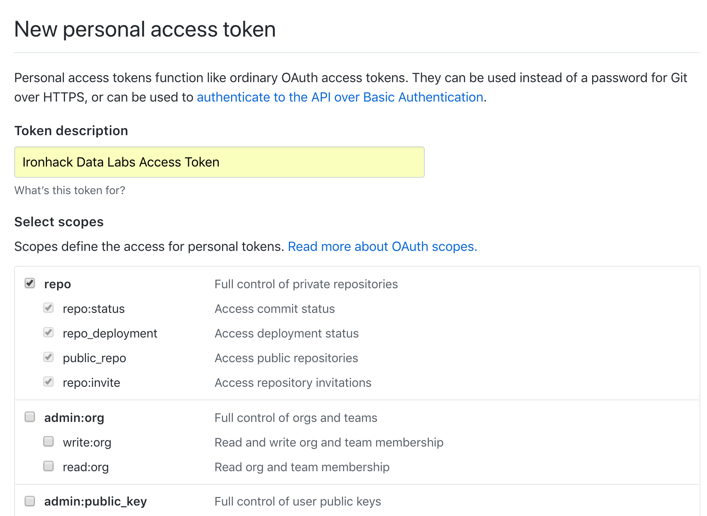

# Lab | API Scavenger Game

## Introduction

In the lesson, you have learned how to make Python requests to APIs and parse the JSON responses to extract the information you need. In this lab, you will practice these skills by playing an API scavenger hunt game. In case you haven't played scavenger hunt when you were a kid, in a scavenger hunt players need to collect a list of items and they receive clues to help them in the mission. In this lab, you will be seeking secrets hidden inside the massive data from the API. Your data analytics skills will make you a cool API detective. 

## Getting Started

In order to get started, we'd like you to create an access token in your [Github account](https://github.com/settings/tokens). 

1. Click `Generate new token` in the page.
1. Enter token description.
1. Select the scopes for which you allow the token to access. Check at least all the `repo` checkboxes as shown in the screenshot below.
1. Click `Generate token`. Github will create a personal access token for you. 



A personal access token is a secret password to allow you or your app to make remote requests to the Github API. It is the same [oAuth](https://oauth.net/) technology as the Twitter developer access token discussed in the lesson but in Github you don't need to wait for the approval and your token will be available immediately. 

:exclamation: Make sure you save the token on your computer because this is the only time you will see the token string. If for any reason you lost your token, simply come back to Github and re-authorize yourself a new token.

:warning: **Do not share your Github personal access token with anyone else! Hackers can use your token to do bad things that make damage and result in suspension of your account.**

After generating the token, you can test it with `curl` in the Terminal. Assuming your Git username is `johndoe` and token is `d10ev1shpm10x5qox9ckw1k9b792p9rq0ogplpn5cyo55`, you can make the curl command in the following way:

```bash
$ curl -u johndoe:d10ev1shpm10x5qox9ckw1k9b792p9rq0ogplpn5cyo55 https://api.github.com/user`
```

If your token is valid, you will see a JSON response that looks like:

```
{
  "login": "johndoe",
  "id": 1234567,
  "node_id": "MDQ6VXNlcjE2NTk3OTg=",
  "avatar_url": "https://avatars3.githubusercontent.com/u/1659798?v=4",
  "gravatar_id": "",
  "url": "https://api.github.com/users/johndoe",
  "html_url": "https://github.com/johndoe",
  "followers_url": "https://api.github.com/users/johndoe/followers",
  ...
}
```

Because it is inconvenient to read long API responses in Terminal, you can export the response into a physical file with the following command:

```bash
$ curl -u johndoe:d10ev1shpm10x5qox9ckw1k9b792p9rq0ogplpn5cyo55 https://api.github.com/user` > outpout.json
```

Then you can open `output.json` with your favorite text editor to have a deep look.

:information_source: Access token is one of the ways to authenticate requests to Github API. Alternatively, you can also use your Github username and password. However, you'll need to manually enter your password every time when you make API requests. In contrast, access token allows you to make requests without entering password manually. For more information about Github API authentications, refer to [this](https://developer.github.com/v3/auth/) and [this](https://developer.github.com/v3/oauth_authorizations/) documentation.

:information_source: From now on, we will not give you step-by-step instructions in the labs. You already have the foundation in Python and data analytics that allows you to research data solutions. We will, however, provide general guidance on how to complete your lab assignments. In case you find it difficult to tackle your assignments with the general guidance, please don't hesitate to ask the instructional team. We are here to help! :v:

## Goals

### Challenge 1: Fork Languages

You will find out how many programming languages are used among all the forks created from the main lab repo of your bootcamp. Assuming the main lab repo is `ironhack-datalabs/madrid-oct-2018`, you will:

1. Obtain the full list of forks created from the main lab repo via Github API.

1. Loop the JSON response to find out the `language` attribute of each fork. Use an array to store the `language` attributes of each fork.
    * *Hint: Each language should appear only once in your array.*

1. Print the language array. It should be something like:

	```["Python", "Jupyter Notebook", "HTML"]```

Again, the documentation of Github API is [here](https://developer.github.com/v3/).

### Challenge 2: Count Commits

Count how many commits were made in the past week.

1. Obtain all the commits made in the past week via API, which is a JSON array that contains multiple commit objects.

1. Count how many commit objects are contained in the array.

### Challenge 3: Hidden Cold Joke

Using Python, call Github API to find out the cold joke contained in the 24 secret files in the following repo:

https://github.com/ironhack-datalabs/scavenger

The filenames of the secret files contain `.scavengerhunt` and they are scattered in different directories of this repo. The secret files are named from `.0001.scavengerhunt` to `.0024.scavengerhunt`. They are scattered randomly throughout this repo. You need to **search for these files by calling the Github API**, not searching the local files on your computer.

Notes:

* Github API documentation can be found [here](https://developer.github.com/v3/).

* You will need to study the Github API documentation to decide which API endpoint to call and what parameters to use in order to obtain the information you need. Unless you are already super familiar with Github API or super lucky, you probably will do some trials and errors. Therefore, be prepared to go back and forth in studying the API documentation, testing, and revising until you obtain what you need.

* After receiving the JSON data object, you need to inspect its structure and decide how to parse the data.

* When you test your requests with Github API, sometimes you may be blocked by Github with an error message that reads:

	> You have triggered an abuse detection mechanism and have been temporarily blocked from content creation. Please retry your request again later.

	Don't worry. Check the parameters in your request and wait for a minute or two before you make additional requests.

**After you find out the secrete files:**

1. Sort the filenames ascendingly.

1. Read the content of each secret files into an array of strings.

1. Concatenate the strings in the array separating each two with a whitespace.

1. Print out the joke.

## Deliverables

* `challenge-1.py` or `challenge-1.ipynb` that contains your solution to Challenge 1.

* `challenge-2.py` or `challenge-1.ipynb` that contains your solution to Challenge 2.

* `challenge-3.py` or `challenge-1.ipynb` that contains your solution to Challenge 3.

## Submission

Upon completion, add your deliverables to git. Then commit git and push your code to the remote.

## Resources

[Github RESTFUL API Documentation](https://developer.github.com/v3/)

[OAuth](https://oauth.net/)

[Github oAuth Authorizations API](https://developer.github.com/v3/oauth_authorizations/)

[Github Other Authorizations API](https://developer.github.com/v3/auth/)

## Additional Challenge for the Nerds

So far we have practiced a lot with the `GET` method but not `PUT`, `POST`, `PATCH`, or `DELETE`. If you wonder what are the differences, refer to the following:

https://spring.io/understanding/REST

Simply put, the `GET` method only allows you to obtain data from API. But the other methods allow you to modify the data stored in the database behind the API. The API must be programmed to support each of these methods though.

The additional challenge for the nerds is for you to use the `PUT` method to create a file in your own repo. You need to grant the correct permissions to your access token in order to make `PUT` requests to your repo. 

### Note:

You don't have to use Python in this complex challenge. Simply find out how to do that with `curl` as proof of concept. That's adequate for the purpose of practicing `PUT` for API.

### Steps:

1. Create a new repo (don't use your forked repo for the lab because you don't want to ruin your lab codes). Assuming your repo is called `johndoe/test-repo`.

1. Call the following API endpoint to create a new file called `test.txt`: 

	```https://api.github.com/repos/johndoe/test-repo/contents/test.txt```

	Notes:

	* You'll need to supply a JSON object as the parameter of the `PUT` method that contains at least `message` and `content`.

	* The `content` string must be encoded with [Base64](https://en.wikipedia.org/wiki/Base64). Here is a website for you to [encode a regular string to Base64](https://www.base64encode.org/).

	For detailed documentation, see: https://developer.github.com/v3/repos/contents/#create-a-file

1. If successful, you should see the following example response from the API:

```
{
  "content": {
    "name": "test.txt",
    "path": "test.txt",
    "sha": "0d5a690c8fad5e605a6e8766295d9d459d65de42",
    "size": 20,
    "url": "https://api.github.com/repos/johndoe/test-repo/contents/test.txt?ref=master",
    "html_url": "https://github.com/johndoe/test-repo/blob/master/test.txt",
    "git_url": "https://api.github.com/repos/johndoe/test-repo/git/blobs/0d5a690c8fad5e605a6e8766295d9d459d65de42",
    "download_url": "https://raw.githubusercontent.com/johndoe/test-repo/master/test.txt",
    "type": "file",
    "_links": {
      "self": "https://api.github.com/repos/johndoe/test-repo/contents/test.txt?ref=master",
      "git": "https://api.github.com/repos/johndoe/test-repo/git/blobs/0d5a690c8fad5e605a6e8766295d9d459d65de42",
      "html": "https://github.com/johndoe/test-repo/blob/master/test.txt"
    }
  },
  "commit": {
    "sha": "16f2907406174e8068ecf976fb6abc24f004a62b",
    "node_id": "MDY6Q29tbWl0MTQ3NjgxMjMyOjE2ZjI5MDc0MDYxNzRlODA2OGVjZjk3NmZiNmFiYzI0ZjAwNGE2MmI=",
    "url": "https://api.github.com/repos/johndoe/test-repo/git/commits/16f2907406174e8068ecf976fb6abc24f004a62b",
    "html_url": "https://github.com/johndoe/test-repo/commit/16f2907406174e8068ecf976fb6abc24f004a62b",
    "author": {
      "name": "John Doe",
      "email": "john.doe@gmail.com",
      "date": "2018-10-30T04:37:34Z"
    },
    "committer": {
      "name": "John Doe",
      "email": "john.doe@gmail.com",
      "date": "2018-10-30T04:37:34Z"
    },
    "tree": {
      "sha": "116ad37d3680a79ef1cf9f555abb0579e293f5b4",
      "url": "https://api.github.com/repos/johndoe/test-repo/git/trees/116ad37d3680a79ef1cf9f555abb0579e293f5b4"
    },
    "message": "test",
    "parents": [
      {
        "sha": "1ab3d7a806e0a44f39ffbb63618fb26938f968ac",
        "url": "https://api.github.com/repos/johndoe/test-repo/git/commits/1ab3d7a806e0a44f39ffbb63618fb26938f968ac",
        "html_url": "https://github.com/johndoe/test-repo/commit/1ab3d7a806e0a44f39ffbb63618fb26938f968ac"
      }
    ],
    "verification": {
      "verified": false,
      "reason": "unsigned",
      "signature": null,
      "payload": null
    }
  }
}
```
