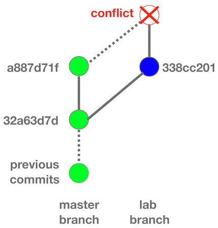
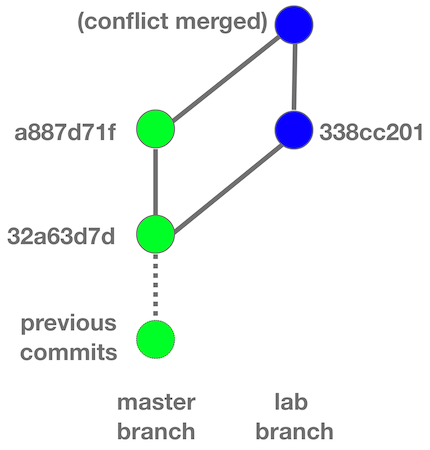
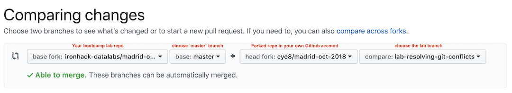

# Lab | Resolving Git Conflicts

## Introduction

Resolving Git conflicts and merging branches is an import skill every software/data engineer must possess because code conflicts occur on daily basis in collaborative projects. This lab will help you learn the complete process of resolving and merging conflicts and become prepared to solve Git conflicts next time you encounter them.

### Prerequisites

* At this point you should have created a fork in your own Git account from the bootcamp's lab repo. 

* You should also have cloned your forked repo to your computer.

If you have any doubts about the prerequisites please clarify with your instructor or teaching assistants.

### Overview of Steps

Below is a summary of the steps you will follow in this lab:

1. Commit changes on local branch and sync with remote.
1. Create a conflict with the master branch.
1. Resolve the conflict.
1. Merge your branch.
1. Push to remote.

**Note: The above is also the general procedure with which you submit assignments in this course. You are not likely to encounter conflicts in this course because only you will be working on your own Git repo. But in your future professional work you'll find yourself using these steps a lot.**

### Deliverables

* Your branch in which conflicts are resolved and merged

* File `your-code/about-me.md` updated with introductions about yourself

## Instructions

### Step 1 - Check Local Branch Status

If you work in a team, every time before you start working on the code you should check if there is any unstaged or uncommited changes in your local branch by executing `git status` within the project directory in Terminal.

In the git status output, check whether there is any **file with unstaged changes** or **untracked files**. Sometimes you may also find **files with changes to be committed**. If you see any of those, you need to stage and commit the changes in Step 2. If you don't see any of those, jump to Step 3.

### Step 2 - [OPTIONAL] Stage and Commit Changes

If you identified unstaged or uncommitted changes in the previous step, you need to stage and commit those changes. Git will not allow you to sync your local branch with the remote if you have unstaged/uncommitted changes that conflict with the remote branch.

To stage changes, execute `git add` for all the files that are untracked or have unstaged changes. Then commit the changes with `git commit`.

After committing, if you do `git status` again you should see something like:

```
Your branch is up to date with 'origin/master'.

nothing to commit, working tree clean
```

### Step 3 - Pull Latest Changes From the Remote Branch

Now that you have staged and committed all changes, you can obtain the latest changes from the remote branch. This step is not required but it is generally a good practice because it can reduce the chance of conflicts when you push your code to remote. Git conflicts occur when more than one developers have changed the same regions of the same files and subsequently merge their respective branches. If you don't pull the latest changes from remote before working on the files that have remote changes, you may run into conflicts at a later time when you push your code back to remote. So it's a good idea is to obtain the latest changes from remote and start working from there.

To pull the latest changes from the remote (assuming you are working on the master branch), execute:

```bash
git pull origin master
```

If your local branch is lagged behind, git will auto merge the codes in your local branch with remote. If the latest code in the remote branch has conflicts with your local branch, you will see warnings and you will need to resolve the conflicts in the next step. However, if there is no conflict or auto merging is successful, you can skip to Step 5.

### Step 4 - [OPTIONAL] Resolve Conflicts

If you encounter conflicts when you sync your branch with the remote, fix the conflicts as the lesson showed you. After resolving the conflict, commit your changes and push your code back to remote.

### Step 5 - Create Conflicting Changes

In your real work you don't create conflicting changes on purpose. But for the sake of practicing in this lab, let's create a conflicting change. Here's how:

1. Currently you should be on the master branch. You will update the `your-code/about-me.md` file by adding or removing anything from the file. Then **add this file to git, commit, and push it to the remote master branch**.

1. Now, find out the ID of the commit prior to your latest commit. You can do this by executing the following command in Terminal:

    ```bash
    git log
    ```

    You will see the history of Git commits with the most recent commits at the top. There is a long ID string associated with each commit that consists of random numbers and letters. Find out **the commit immediately before your recent commit** and copy its ID string.

    Let's assume the commit ID of your recent commit is `a887d71f8107294bf4f05cca8a0d584e4914f05c`, and the commit prior to your recent commit is `32a63d7d09589d80a8ff614be85d854792798aee`.

1. Revert to the commit before you made the latest change. You can do that by executing:

    ```bash
    git reset --hard 32a63d7d09589d80a8ff614be85d854792798aee
    ```

1. Now you are still on the master branch but the tip of your local branch is at the previous commit. Create a new branch called `lab-resolving-git-conflicts`:

    ```bash
    git checkout -b lab-resolving-git-conflicts
    ```

1. On the new branch, open `your-code/about-me.md`, remove everything in the file and replace with an introduction about yourself. 

    Below is a template you can use to introduce yourself:

    ```
    # Who am I

    * Where are you from?
    * What do you do?
    * Do you have previous experience with technology/data?

    # Why am I here

    * What has brought you to Ironhack?
    * What knowledge/skills do you expect to learn in this bootcamp?

    # What will I do after the bootcamp?

    * Which industry will you seek employment in?
    * What will your future role look like?
    * What is your career goal?
    ```

1. Now, add the updated `your-code/about-me.md` file to git and commit and let's assume the ID of the new commit is `338cc201764793e1896744e8fd575e3c09c97a09`. Now execute `git pull origin master` and Git will report you have a conflict that prevents you from merging the branches. Your Git tree currently looks like below.

    

### Step 6 - Resolve Conflicts

Resolve the conflicts in the affected files. You can see which files have conflicts by executing `git status`. You will need to examine each of the files with conflicts and fix them manually. After you are done fixing conflicts, double check / test the files to make sure you haven't missed anything.

### Step 7 - Commit and push Changes

After resolving the conflicts, add the fixed files and commit. In the commit message, use descriptive words such as `resolving conflicts with master branch`. Then push your local branch to remote. Now your git tree will look like this:



### Step 8 - Make Pull Request

Make a pull request to **merge the `lab-resolving-git-conflicts` branch of your fork to the bootcamp's lab repo**. This can be done in the webpage of your bootcamp's lab repo. Select the correct repos and branches in both the *base* and *head*. Git should tell you the pull request is able to be merged. Your pull request should look like:


