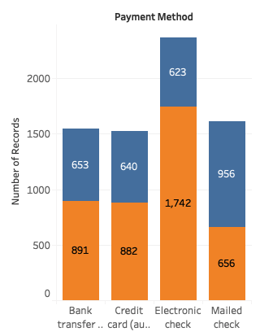
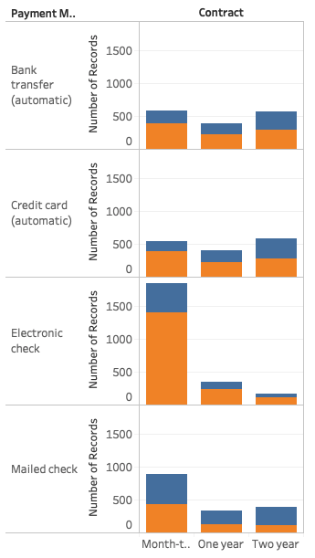
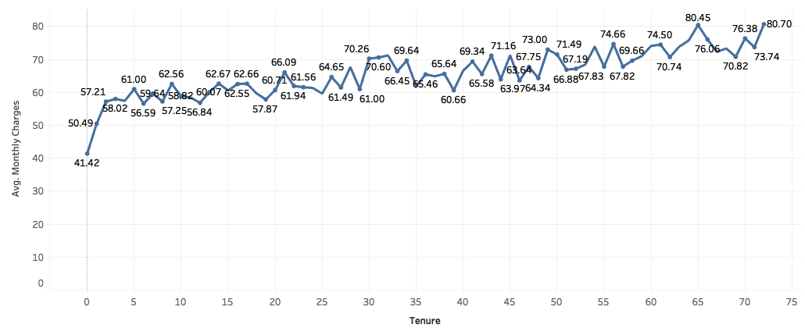
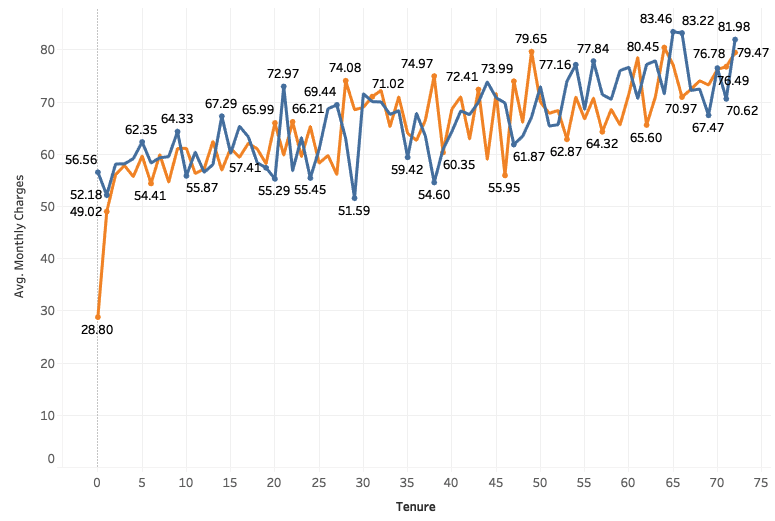
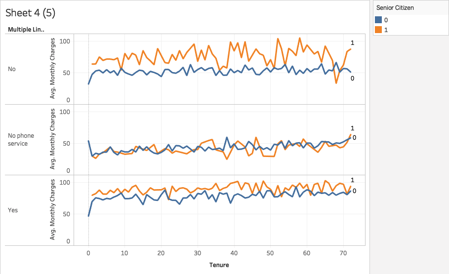
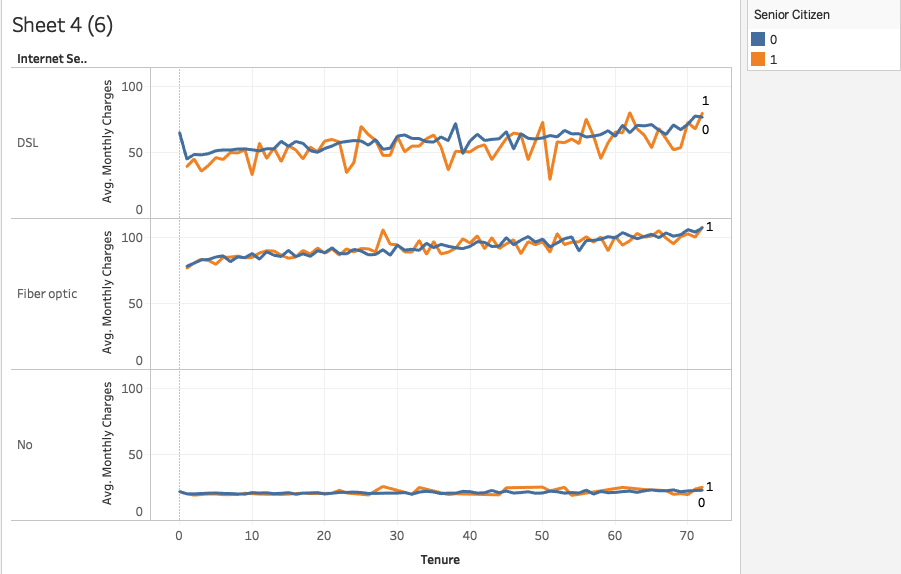

# Lab | BI Analysis with Tableau

## Introduction

In this lab, we will practice performing business intelligence analysis on a company's customer data. We will use a public dataset from Kaggle which can be obtained [here](https://www.kaggle.com/blastchar/telco-customer-churn). The dataset is likely to be the customer records of a telecom company where customers' personal identifiable information has been removed. It contains customer information such as their demographic information, what telecom services the customer uses, billing information, etc. In specific, the last column of the dataset is `Churn`, which is a business jargon indicating customers who have cancelled their service. In the Kaggle project, data scientists use this dataset to practice predicting customer behavior in order to retain them. In our lab today, we will use the dataset to practice Business Intelligence Analysis with Tableau.

But before you start, we would like you to spend 10 minutes to study the following resources on what is a *measure* versus *dimension*?

- **[Dimensions and Measures, Blue and Green](https://onlinehelp.tableau.com/current/pro/desktop/en-us/datafields_typesandroles.htm)**

## Getting Started

To complete this lab, follow each of the steps below.

1. Open Tableau and import the `churn.csv` file.
2. Let's start out by exploring the company's customers from a demographics perspective. The goal is to get familiar with the dataset and obtain some general insights of the characteristics of the customers. But remember this is only for the purpose of practicing Tableau BI analysis. You can choose to do some of these explorations or some other preliminary analyses as you consider relevant in your real projects.
    1. Create a new worksheet and drop the Number of Records measure into the center. You should see that the total customer count is 7,043.
    1. Drag and drop the Gender dimension into the Rows area and the Partners dimension into the Columns area.
    1. Click on the Show Me menu at the top right of the screen and select the highlight table visualization so that we can see the density of records as we continue to build our view.
    1. Add the Dependents dimension to the Columns area (next to Partners).
    1. Convert the Senior Citizen measure to a dimension by right clicking on it and selecting *Convert to Dimension*. 
        - Why do we convert this column from measure to dimension? From the article resource you read, measures contain numeric, quantitative values that Tableau can automatically aggregate, calculate average and median, etc. But dimensions contain qualitative values that are typically categorical where Tableau can perform actions like count, groupby, etc.
        - If you look into the values in the `Senior Citizen` column, you'll see `0` and `1` instead of `Yes` and `No`. That is why Tableau thought this column is a measure. But we human beings are smarter and know in this context `0` means `No` and `1` means `Yes`. Therefore it is actually categorical data. It makes total sense to convert it to a dimension so that we can group by it.
    1. Drag and drop the new Senior Citizen dimension into the Rows area (right next to Gender).
    1. From the Analysis menu, select *Totals > Show Row Grand Totals* and then *Totals > Show Column Grand Totals*.
    1. From the statistical summary, We should be able to obtain 3 insights: 
        - The majority of the company's customers tend to be non-senior individuals.
        - There is a fairly even split between male and female customers.
        - For customers who have no partners, they tend to have no dependents as well.
3. Another perspective from which we can view the customer data is the core services they signed up for. The relevant columns include `Phone Service`, `Multiple Lines`, and `Internet Service`. In case you haven't noticed, `Multiple Lines` refers to whether the customer signed up for multiple phone lines with the company.
    - Create a new worksheet containing another highlighted table visualization with the Phone Service and Multiple Lines dimensions as rows and the Internet Service dimension as columns.
    - Add row and column grand totals to this visualization as well.
    - There are a few insights that we should be able to derive from this visualization.
        - Most of the company's customers have both phone and internet service with the company.
        - Fiber optic is the most popular type of internet service, especially among customers that have phone service with multiple lines.
        - DSL is the only type of internet service provided to customers that do not have phone service.
4. We can also look at what billing options are most popular among customers. This time we ask you to figure out how to create a stacked bar chart that:
    - Shows an intuitive view on which Payment Method (i.e. Bank Transfer, Credit Card, Electronic Check, and Mailed Check) is most popular with the Paperless Billing option (`Yes` and `No`).
    - Displays a number of records label on each segment of the stacked bars.
    - Your visualization should look like this: 

        .

    - From this visualization, we can see that most customers who have paperless billing also pay via electronic payment methods (with electronic check being the most popular), while payment via mailed check is the most popular payment option for customers who do not have paperless billing.
    - Bonus: You can also blend in the Contract dimension to get a more granular view of which billing options are most popular among customers on Month-to-Month, One Year, and Two Year service contracts. How? Your visualization should look like this:

        .

    - What are your observations?

5. Now that we have looked at customer distribution from a variety of perspectives, let's shift our focus to some of the other measures in our data set. Specifically, let's take a look at how pricing (Monthly Charge) changes with longevity (Tenure). 
    - Create a visualization that:
        - Is a line chart where Tenure is the X axis and Average Monthly Charges is the Y Axis.
        - Shows Average Monthly Charges as labels on the data points of the line chart.
    - Your line chart should look like below:

        .

    - We can see that the average monthly charge across all customers starts out at $41.42, increases sharply in the first three months to $57.21, and then continues to increase gradually to eventually reach the $80 price range.
6. We can observe the relationship between Monthly Charges and Tenure from a variety of perspectives to gain insight into how pricing changes for different subsets of customers.
    1. The first perspective we want to gain insight is the gender difference.
        1. Create a duplicate of the previous Monthly Charge by Tenure visualization.
        1. Add the Gender dimension to the Marks section so that we have two lines now on the same chart - one for men and one for women. Your new chart should look like below:

            .

    1. One of the interesting insights we can see from this perspective is that the company charges new women customers twice as much on average than new male customers. However, we see that by the third month, the price level for men is back up to where it is for women. 
    1. How to interpret the insight above? Well, one possibility is that the company regularly runs low-cost 3-month introductory promotions targeted at men to try their services. Do you have other interpretation?
    1. Create another duplicate of the original Monthly Charge by Tenure visualization. Add the Senior Citizen dimension.
    1. Add the Senior Citizen dimension to the chart. What do you notice? Does the company charge more, less, or the same for senior citizens compared to non-senior citizens?
7. The pricing charts we have looked at thus far makes it seem like the company is providing cheaper services to some customers based on demographics. However, we should also take into consideration that pricing is typically heavily dependent on services purchased (e.g. Multiple Lines and Internet Service. It may just be that seniors purchase more expensive services (i.e. multiple lines and type of Internet service) on average than younger customers. To test our theory, let's look at how pricing varies across services.
    - Create another duplicate of the original Monthly Charge by Tenure visualization. Add the relevant dimensions to visualize how average monthly charge varies for seniors vs non-seniors when the customer signed up for multiple lines. Your end product should look like this:

        

    - Create another duplicate of the original Monthly Charge by Tenure visualization. Add the relevant dimensions to visualize how average monthly charge varies for seniors vs non-seniors when the customer signed up for different Internet Service. Your end product should look like this:

        

    - The charts above suggest the company charges seniors significantly more than non-seniors for those who sign up for single-line phone service. The company charges seniors slightly more than non-seniors for those who sign up for multiple-line phone service. There is no obvious charge difference between senior and non-senior when they sign up differen types of Internet Service.
8. Instead of using line charts to visualize pricing for different demongraphics vs services separately, we can also visualize both demographics *and* services at the same time using *highlight table*.
    - Create a highlight table to visualize Average Monthly Charges by Internet Service and Multiple Lines (rows) and Gender and Senior Citizen (columns).
    - Display row and column grand totals.
    - From this perspective, we can see that the prices for the different combination of core services do not differ significantly across demographic features.
9. Let's use the highlight table to visualize with percentages instead of totals.
    1. Create a new highlight table to visualize Internet Service (row) agains Senior Citizen (column) on the Number of Records.
    1. Display the Grant Total for both rows and columns.
    1. Select Analysis > Percentage Of > Column in the menu. This displays the percentage instead of totals.
    1. Your visualization should look like:

        

    - From this visualization, we can see that the proportion of customers that have fiber optic internet (the highest price service) is higher among seniors than it is among non-seniors. This is likely the cause for the price difference among those two groups. Seniors indeed tend to sign up for more expensive services.
10. The final perspective we will analyze this data set from is the number of customers that churn by demographic and service combination.
    - Create another duplicate of the highlight table visualization showing pricing by demographics and services.
    - Create a calculated field called Churned by going to *Analysis > Create Calculated Field* and entering the following formula: `IF [Churn]='Yes' THEN 1 ELSE 0 END`.
    - Drag and drop the newly-created Churned measure to replace Monthly Charges wherever it appears in the Marks section.
    - By default, Tableau will sum the measure which will show us the number of customers that churned in each segment. This is useful, but what we really want to see is the percentage of customers that churned. To see this, click on the drop-down next to the dimension wherever it appears in the Marks section, select *Measure*, and change the value to *Average*.
    - We can see that the churn rates are higher for fiber optic internet across the board than for any other service. We know that fiber is also the highest priced, so perhaps customers aren't happy paying such high prices.
11. Next, we are going to combine all the visualizations we used to explore the data into a Tableau Story.
    - Create a new Story by clicking on *Story > New Story*).
    - Our story should document our journey throughout this lab, so you should create a Story Point for each visualization we have created. You can create a new Story Point by clicking on the *Blank* button under the *New Story Point* heading in the left pane of the workbook.
    - Drag and drop each visualization into a new Story Point.
    - Add a caption for each Story Point that briefly describes the chart. For example, the first one can be captioned *Customer Demographics*, the second one can be captioned *Customers by Service*, etc.
    - Add an annotation to each Story Point describing the insights derived from the visualization. If you're having trouble with what to write, you can copy and paste the insights we have been documenting throughout each of the tasks above.
12. Save your work to Tableau Public, ensure that your workbook is viewable, and copy the URL for the workbook into the deliverables file for this lab.

## Deliverables

- `main.txt` file with a link to your Tableau Public workbook.

## Submission

Upon completion, add your deliverables to git. Then commit git and push your branch to the remote.

## Resources

- [Telco Customer Churn](https://www.kaggle.com/blastchar/telco-customer-churn/home)

- [Dimensions and Measures, Blue and Green](https://onlinehelp.tableau.com/current/pro/desktop/en-us/datafields_typesandroles.htm)

- [Tableau Training Videos](https://www.tableau.com/learn/training)

- [Convert a Measure to a Dimension | Tableau](https://onlinehelp.tableau.com/current/pro/desktop/en-us/datafields_typesandroles_convertdimtomeas.htm)

- [Show Totals in a Visualization | Tableau](https://onlinehelp.tableau.com/current/pro/desktop/en-us/calculations_totals_grandtotal_turnon.htm)

- [Get Started with Calculations in Tableau](https://onlinehelp.tableau.com/current/pro/desktop/en-us/calculations_calculatedfields_create.htm)

- [Stories | Tableau](https://onlinehelp.tableau.com/current/pro/desktop/en-us/stories.htm)

- [Change the Type of Mark in the View](https://onlinehelp.tableau.com/current/pro/desktop/en-us/viewparts_marks_marktypes.htm)