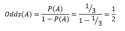
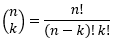
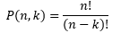
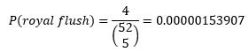
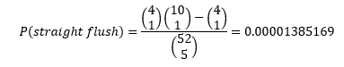

# Calculating Odds

## Introduction

The field of probability was developed specifically for games of chance. Therefore, it is only natural that we use games of chance in our guided lesson.To decide whether a bet is worthwhile for us, it is beneficial to calculate the odds. 

## Odds

We recall looking at the probability of an event. The probability of an event is the ratio between the number of times an event occurred and the sample space. In contrast, the odds of an event are the ratio between the probability that an event will occur and the probability that an event will not occur. 

For example, if we have a fair die. Event A is the case where we get a number less than 3 number in one roll. 

A = {1, 2}

Therefore, P(A) = 2/6 = 1/3

We use this probability to calculate the odds of A:



The odds in this case are 1/2. We may also say that the odds are 2:1. It means that for every 3 die rolls 1 will result in event A occurring and 2 will not.

Let's define a Python function that computes the odds and verify this result.

```
>>> def odds(prob):
...     return(prob/(1-prob))

>>> odds(1/3)
0.49999999999999994
```


## Playing Poker with Python

We will use the game of poker to learn more about computing odds. The key in playing poker is to know the probabilities or odds of different hands in order to make an optimal decision.

### Combinations and Permutations: A Primer

In order to talk about poker hands, we must first introduce combinations and permutations. The most efficient way to count the number of possible ways to get a hand is by using combinations and permutations.

#### Combinations

Combinations is a selection of a subset of objects from a larger set. In a combination the order in which objects were selected does not matter. A combination of k elements from a set of n elements is known as "n choose k" and noted .

The scipy library contains a function for computing combinations called `comb`. For example, here we will compute 52 choose 5.

```
>>> from scipy.misc import comb
>>> comb(52, 5)
2598960.0
```

#### Permutations

Permutations differ from combinations in that the order in which objects are selected matters. Permutations are noted .

### Calculating the Odds of Different Poker Hands

#### Royal Flush

The top hand in poker is a royal flush. A royal flush contains A, K, Q, J, and 10 all from the same suit.

A deck of cards contains 52 cards. In a deck of cards, we have 4 suits where each suit contains 13 cards. Therefore, to have a royal flush, we must select a suit, so there is a 1 of 4 chance that we select a specific suit. Then each suit has only one of the cards in the hand. Therefore there are a total of 4 possible royal flushes in the deck.

The probability of a royal flush is 4 divided by the number of all possible hands. We find the number of all possible hands which is 52 choose 5. Therefore, the probability of a royal flush is .

Using Python we can compute the probability and the odds. We will use the odds function that we have previously defined in this lesson.

```
>>> royal_flush_prob = 4/comb(52, 5)
>>> royal_flush_prob
1.5390771693292702e-06
>>> royal_flush_odds = odds(royal_flush_prob)
>>> royal_flush_odds
1.5390795380914492e-06
```    
The odds are 649,739:1. Which means that for every 649,740 hands played, one will be a royal flush and the rest will not.

#### Straight Flush

A straight flush is every sequence of 5 consecutive cards from the same suit that is not a royal flush. There are 10 such sequences in total so we must compute the number of sequences and then subtract the number of royal flushes from that number.

In order to calculate the probability, we first choose a suit and then choose the sequence. There are 4 suits and 10 sequences, and we pick one of each. Therefore, the probability of a straight flush is: .

```
>>> straight_flush_prob = (comb(10,1)*comb(4,1)-comb(4,1))/comb(52,5)
>>> straight_flush_prob
1.3851694523963431e-05
>>> straight_flush_odds = odds(straight_flush_prob)
>>> straight_flush_odds
1.385188639606237e-05
``` 

The odds of a straight flush are 72,192:1.


## Summary

In this lesson we learned how to compute probabilities and odds for a couple of different poker hands. To do this, we learned about combinations and permutations.
