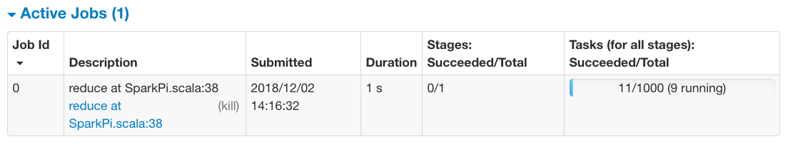

# Challenge 2: PySpark Local Mode Installation with Jupyter Notebook Integration

In this challenge, you will install Apache Spark on your computer in the local model and test the installation.

Installing cutting-edge open-source software for programming is always troublesome even for pros. There are plenty of tutorials online but the problem is you don't know which one will work for you until you test them out one by one. Sometimes even the tutorials on the developer's website don't work. Also, when you encounter technical problems, it's difficult to know if it's because the tutorial does not work or because there is something missing or broken on your computer. The more open-source software you install and configure, the more experience you gain which will allow you to know better next time installing other software.

We are providing step-by-step instructions for [Mac users](#mac-users) to follow in this challenge to install Spark. For [Windows users](#windows-users) and [Ubuntu users](#ubuntu-users), we also identified good tutorials. In case the instructions or the videos don't work for you. your instructor and TA will for sure help you.

**Suggested time on this challenge: 90-120 min**

## Objectives

* Install PySpark (Spark with Python) in local mode with Jupyter Notebook integration.
* Test your PySpark installation in command line.
* Test your PySpark integration with Jupyter Notebook with sample code.

## Windows Users

Please follow the instructions in the tutorials below to install PySpark in Windows.

**Tutorial: [Install Spark on Windows (PySpark)](https://medium.com/@GalarnykMichael/install-spark-on-windows-pyspark-4498a5d8d66c)**

**Video: [Install Spark on Windows (PySpark) + Configure Jupyter Notebook](https://www.youtube.com/watch?v=t63PS3kiTTQ)**

## Ubuntu Users

Please follow the instructions in the tutorials below to install PySpark in Windows.

**Tutorial: [Install Spark on Ubuntu (PySpark)](https://medium.com/@GalarnykMichael/install-spark-on-ubuntu-pyspark-231c45677de0)**

**Video: [Install Spark on Ubuntu (PySpark) + Configure Jupyter Notebook](https://www.youtube.com/watch?v=uhVYTNEe_-A)**

## Mac Users

### Step 1: Installing Spark

Mac users don't need to install Anaconda though they still can do that if they want. We have installed most of the prerequisite software when we setup the development environment at the beginning of this course. The following is the verified simplest installation process for PySpark.

1. Install *xcode-select*.

	Run the following command in Terminal:

	```bash
	xcode-select --install
	```

	If you receive an error message that says the command line tools are already installed, you can proceed to the next step. Otherwise, follow the instructions provided in the prompt window and complete installation of *xcode-select*.

1. Install Java SDK.

	```bash
	brew install java
	```

	If you encounter errors about purging permissions, run the following command:

	```bash
	sudo chown -R $(whoami):staff ~/Library/Caches/Homebrew /usr/local/Caskroom
	```

1. Install Apache Spark.

	```bash
	brew install apache-spark
	```

### Step 2: Set Environmental Variables

You are required to set the proper environmental variables (envvars) in your OS so that the software you use (e.g. command line tool and Jupyter Notebook) knows where to execute Spark.

Setting envvars is achieved by adding the following commands in your `~/.bash_profile` tool:

```bash
export SPARK_HOME=/usr/local/Cellar/apache-spark/2.4.0/libexec
export SPARK_PATH=/usr/local/Cellar/apache-spark/2.4.0
export PYSPARK_PYTHON=/usr/local/bin/python3
export PYSPARK_DRIVER_PYTHON="jupyter"
export PYSPARK_DRIVER_PYTHON_OPTS="notebook"
alias snotebook='$SPARK_PATH/bin/pyspark --master "local[*]"'
```

After saving `~/.bash_profile`, restart your Terminal (the envvars are picked up by Terminal every time when it starts) and make sure there is no error when Terminal is started.

*Notes:*

* If you are using advanced command line tools other than Terminal, such as [Oh My ZSH](https://ohmyz.sh/), you may need to configure the envvars in other files (you should already know where to add becasue you're using advanced command line tools).

* At the time this tutorial is written, the latest Spark version is v2.4.0. The locations of `SPARK_HOME` and `SPARK_PATH` depend on the actual Spark version you install. Therefore, make sure the paths you set for these two envvars are valid.

* `PYSPARK_PYTHON` tell PySpark which Python executable it should use.

* `PYSPARK_DRIVER_PYTHON` and `PYSPARK_DRIVER_PYTHON_OPTS` tells PySpark which interactive Python coding program you want to use in programming Python applications for Spark. In our case, we use Jupyter Notebook.

* The alias `snotebook` creates a shortcut to start your PySpark executable. The `--master "local[*]"` param tells Spark that you are running the master process on your local computer and Spark should decide how many parallel processes it can automatically create when you invoke the `parallelize` command in Python.

### Step 3: Test Spark Installation in Command Line

1. In your Terminal, execute `spark-shell`. Spark will be started and you will see the Spark version you have installed:

	```text
	Spark context Web UI available at http://localhost:4040
	Spark context available as 'sc' (master = local[*], app id = local-1543777174398).
	Spark session available as 'spark'.
	Welcome to
	      ____              __
	     / __/__  ___ _____/ /__
	    _\ \/ _ \/ _ `/ __/  '_/
	   /___/ .__/\_,_/_/ /_/\_\   version 2.4.0
	      /_/
	Using Scala version 2.11.12 (Java HotSpot(TM) 64-Bit Server VM, Java 1.8.0_192)
	Type in expressions to have them evaluated.
	Type :help for more information.
	scala>
	```

	After Spark is started, you will enter the Scala shell command line. If you accomplish this step, congratulations for successfully installing Spark!

1. Test the Spark Web UI at [http://localhost:4040](http://localhost:4040). Note that you *may* have a different URL depending on the setup of your computer. Use the actual URL Spark printed when you started `spark-shell`.

1. Now we'll run a Spark command line test by submitting a job to Spark. This is how you submit jobs to Spark in production. Quit the current Spark session by entering `:q` in the Scala shell or simply presst `CTRL+D`. Make sure no other Spark processes are running. Your Spark Web UI should go down.

1. In your Terminal, execute the command below. If you are not using Spark v2.4.0, update the Java executable path (`/usr/local/Cellar/apache-spark/2.4.0/libexec/examples/jars/spark-examples_2.11-2.4.0.jar`) accordingly.

	```bash
	spark-submit --class org.apache.spark.examples.SparkPi /usr/local/Cellar/apache-spark/2.4.0/libexec/examples/jars/spark-examples_2.11-2.4.0.jar 1000
	```

	This command will execute a testing script that comes with Spark for 1,000 times. It will last for about 40 seconds to finish.

1. While the above scripts are being executed, launch the Web UI [http://localhost:4040](http://localhost:4040). You should see an active job in the Web UI that looks like:

	

	After the Spark job is finished, the Web UI will go down again.

### Step 4: Test Jupyter Notebook Integration with PySpark

If your Step 2 is successful, the Jupyter Notebook integration with PySpark should already been accomplished. Now let's give it a test.

You have created an alias in your `.bash_profile` that is called `snotebook`. So you can simply run `snotebook` in your Terminal. Alternatively, you can run the full command:

```bash
$SPARK_PATH/bin/pyspark --master "local[*]"
```

Jupyter Notebook should open in your browser.

## Resources

[Install Spark on Windows (PySpark)](https://medium.com/@GalarnykMichael/install-spark-on-windows-pyspark-4498a5d8d66c)

[Install Spark on Windows (PySpark) + Configure Jupyter Notebook](https://www.youtube.com/watch?v=t63PS3kiTTQ)

[Install Spark on Ubuntu (PySpark)](https://medium.com/@GalarnykMichael/install-spark-on-ubuntu-pyspark-231c45677de0)

[Install Spark on Ubuntu (PySpark) + Configure Jupyter Notebook](https://www.youtube.com/watch?v=uhVYTNEe_-A)

[Install Spark on Mac (PySpark)
](https://medium.com/@GalarnykMichael/install-spark-on-mac-pyspark-453f395f240b)

[Install Spark on Mac + Configure Jupyter Notebook (Python)](https://www.youtube.com/watch?v=I5JtvpyM14U)

[How to Install Scala and Apache Spark on MacOS](https://medium.freecodecamp.org/installing-scala-and-apache-spark-on-mac-os-837ae57d283f)