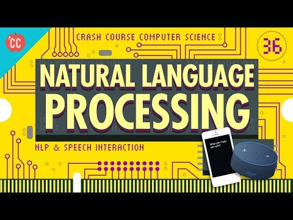
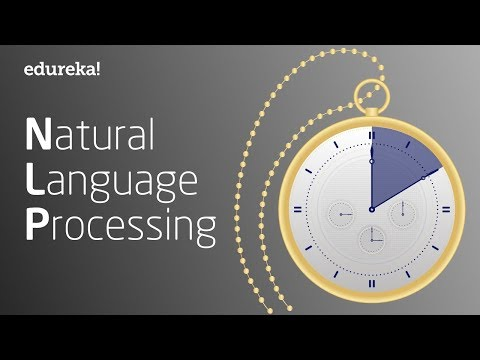

# Challenge 1: Natural Language Process Overview

In this challenge, we will present an overview of Natural Language Processing, or NLP. You will watch two videos to have a general understanding about NLP.

**Suggested time on this challenge: 30 min**

## Objectives

* Understand what is NLP.
* Learn about the general evolution of NLP technology.
* Learn about the common areas of research in NLP.
* Learn about the common applications of NLP.
* Understand the general steps to conduct NLP analysis.
* Install NLTK.

## Install NLTK

Before we start learning, let's first install [Python NLTK](https://www.nltk.org/) because it takes a while to download the package. Follow the steps below.

1. **Install NLTK:** 

	If you have installed `pip` on your computer, simply run `pip install nltk`. If you don't have `pip`, follow the instructions [here](https://www.nltk.org/install.html).

1. **Install NLTK data:** 

	Launch Python shell and execute

	```python
	>>> import nltk
	>>> nltd.download()
	```

The data library is over 3gb and take a while to download. You can view the downloading progress in the download manager that is automatically opened by NLTK. While the data are being downloaded, proceed to the next section.

For more information about downloading NLTK data, refer to [here](https://www.nltk.org/data.html).

## Video 1: [Natural Language Processing Crash Course](https://www.youtube.com/watch?v=fOvTtapxa9c)

[](https://www.youtube.com/watch?v=fOvTtapxa9c)

### Key Knowledge Points

* Computer language vs natural (human) language: how they differ?
* Why NLP needs to deconstruct the natural language in order to analyze?
* What is the biggest problem for computer to understand natural language?
* What is a *parse tree*?
* How are the first-generation NLP algorithms (based on semantic rules) different from modern NLP algorithms (based on knowledge graphs and machine learning)?
* How did early-generation chatbots (e.g. Eliza) recognize natual languge? What are the limitations?
* How do modern chatbots (e.g. [IBM Watson](https://www.ibm.com/watson/how-to-build-a-chatbot/), [Facebook Messenger Chatbot](https://developers.facebook.com/docs/messenger-platform/built-in-nlp/)) recognize natural language?
* What is speech recognition? What is its relation to NLP?
* How does speech recognition work (how do computers translate sounds into texts)?
* What is speech synthesis?
* What are essential for NLP algorithms to produce more accurate results?

## Video 2: [Natural Language Processing In 10 Minutes](https://www.youtube.com/watch?v=5ctbvkAMQO4)

[](https://www.youtube.com/watch?v=5ctbvkAMQO4)

### Key Knowledge Points

* What is text mining / text analysis?
* What is sentiment analysis?
* What are the common areas of application of NLP?
* What are the 6 general steps of NLP analysis?
* What is *tokenization*?
* What is *stemming*?
* What is *lemmatization*? How is lemmatization different from stemming?
* What are *POS tags*?
* What does *named entity recognition* do?
* What does *trunking* do?

## Test NLTK Installation

Now your NLTK data library should have finished downloading. Confirm that in the download manager. Launch Python shell and test the installation:

```python
>>> from nltk.corpus import brown

>>> brown.words()[0:10]
['The', 'Fulton', 'County', 'Grand', 'Jury', 'said', 'Friday', 'an', 'investigation', 'of']

>>> brown.tagged_words()[0:10]
[('The', 'AT'), ('Fulton', 'NP-TL'), ('County', 'NN-TL'), ('Grand', 'JJ-TL'), ('Jury', 'NN-TL'), ('said', 'VBD'), ('Friday', 'NR'), ('an', 'AT'), ('investigation', 'NN'), ('of', 'IN')]

>>> text = 'Ironhack is a Global Tech School ranked num 2 worldwide. 

Our mission is to help people transform their careers and join a thriving community of tech professionals that love what they do. This ideology is reflected in our teaching practices, which consist of a nine-weeks immersive programming, UX/UI design or Data Analytics course as well as a one-week hiring fair aimed at helping our students change their career and get a job straight after the course. We are present in 8 countries and have campuses in 9 locations - Madrid, Barcelona, Miami, Paris, Mexico City,  Berlin, Amsterdam, Sao Paulo and Lisbon.'

>>> from nltk import sent_tokenize, word_tokenize

>>> sent_tokenize(text)
['Ironhack is a Global Tech School ranked num 2 worldwide.', 'Our mission is to help people transform their careers and join a thriving community of tech professionals that love what they do.', 'This ideology is reflected in our teaching practices, which consist of a nine-weeks immersive programming, UX/UI design or Data Analytics course as well as a one-week hiring fair aimed at helping our students change their career and get a job straight after the course.', 'We are present in 8 countries and have campuses in 9 locations - Madrid, Barcelona, Miami, Paris, Mexico City,  Berlin, Amsterdam, Sao Paulo and Lisbon.']

>>> word_tokenize(text)
['Ironhack', 'is', 'a', 'Global', 'Tech', 'School', 'ranked', 'num', '2', 'worldwide', '.', 'Our', 'mission', 'is', 'to', 'help', 'people', 'transform', 'their', 'careers', 'and', 'join', 'a', 'thriving', 'community', 'of', 'tech', 'professionals', 'that', 'love', 'what', 'they', 'do', '.', 'This', 'ideology', 'is', 'reflected', 'in', 'our', 'teaching', 'practices', ',', 'which', 'consist', 'of', 'a', 'nine-weeks', 'immersive', 'programming', ',', 'UX/UI', 'design', 'or', 'Data', 'Analytics', 'course', 'as', 'well', 'as', 'a', 'one-week', 'hiring', 'fair', 'aimed', 'at', 'helping', 'our', 'students', 'change', 'their', 'career', 'and', 'get', 'a', 'job', 'straight', 'after', 'the', 'course', '.', 'We', 'are', 'present', 'in', '8', 'countries', 'and', 'have', 'campuses', 'in', '9', 'locations', '-', 'Madrid', ',', 'Barcelona', ',', 'Miami', ',', 'Paris', ',', 'Mexico', 'City', ',', 'Berlin', ',', 'Amsterdam', ',', 'Sao', 'Paulo', 'and', 'Lisbon', '.']
```

If you see the above outputs and have no errors, you've successfully installed NLTK and NLTK data!